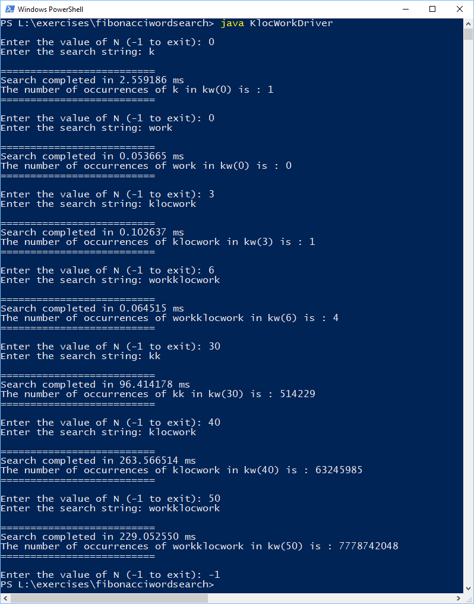

# Fibonacci Word Search

## About

This program computes the number of occurrences of a string in a fibonacci sequence string.

The fibonacci sequence string, kw(N) for a given N, is generated using the relation:

**kw(N) = kw(N-1) + kw(N-2)**,

with, **kw(0) = "kloc"** and **kw(1) = "work"**

## System Requirements

A personal computer, with the JDK and JRE installed to build and run the source code. This code was built and tested on
JRE and JDK 1.8.0_171. However, you should be able to build and run it using Java 1.8.0 or higher.

## Installation

Download the files under the source tree into a folder.

### Compile

javac -d . .\src\KlocWorkDriver.java .\src\com\klocfun\KlocWorkSearch.java

### Run

java KlocWorkDriver

## Computation Strategy

### Naive approach

Generate the string kw(N) and then search the string character by character. However, the string kw(N) grows rapidly as N increases. As N approaches (40 - 45), the string becomes large enough to cause "out of memory" errors on the JVM, and starts hitting the upper limits of what a string can even hold. In general, the naive strategy uses a lot of space to hold intermediate computations, and is time intensive given the number of string matches that need to be performed.

### Optimization

Instead of using recursion with memoization to compute the value of kw(N) from kw(N-1) and kw(N-2), a simple iterative approach from 2 to N will do the trick, and allows us to throw away kw(n-3) as we keep increase n towards N.

In addition, this program uses a "partition" value (partitionN) i.e. once the N exceeds the partition value (Default is 31), the following strategy is employed to compute the number of occurrences:

Let's assume a partition value of 31.

We know that,

**kw(32) = kw(31) + kw(30)**

Similarly,

**kw(33) = kw(32) + kw(31) = kw(31) + kw(30) + kw(31)**

and so all further N greater than the partitionN, kw(N) can be generated from a combination of

**kw(partitionN) + kw(partitionN - 1)**

So, to calculate kw(N), we simply need to know the number of occurrences of the search string in the following places:

1. kw(partitionN)
2. kw(partitionN - 1)
3. At the boundary between kw(partitionN) and kw(partitionN - 1)
4. At the boundary between kw(partitionN) and kw(partitionN)
5. At the boundary between kw(partitionN - 1 ) and kw(partitionN)
6. At the boundary between kw(partitionN - 1) and kw(partitionN - 1)

Once we have the occurence numbers of the searchString, in the above search spaces, finding the number of occurrences in kw(N) becomes a simple
matter of adding occurence counts, to arrive at the final occurrence count.

## Usage Example

## Meta

Developed by - Sid Shankar - sidshank@umich.edu
